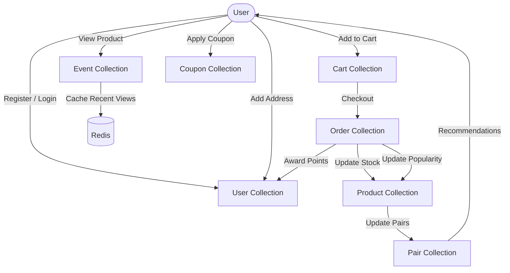

# 🛍️ E-Commerce Backend API

<div align="center">


**Scalable, event-driven backend for modern e-commerce.**  
✅ Cart & Checkout ✅ Loyalty Points ✅ AI-style Recommendations ✅ Real-time Events

</div>

## 📌 Features
| Domain | What’s Inside |
|--------|---------------|
| 🔐 **Users** | Register / Login (bcrypt + JWT), multiple addresses, points & rewards |
| 🛒 **Cart** | Add / update / merge, auto-expire abandoned carts |
| 📦 **Orders** | Checkout, coupons, status pipeline (`pending → paid → shipped → delivered`), stock & popularity sync |
| 🏷️ **Products** | CRUD, images array, stock, popularity score, category link |
| 📂 **Categories** | Auto-capitalised names, hierarchical ready |
| 🎯 **Events** | Product-view tracking → Redis cache → popularity ++ |
| 🧠 **Recommendations** | Real-time pair mining (“Customers who bought A also bought B”) |
| 🎁 **Coupons** | % or flat discount, expiry, usage limits |
| 💰 **Loyalty** | Award points on order completion, redeem on checkout |
| 🚚 **Address** | CRUD, default flag, linked to orders |
| 🌍 **DevEx** | Joi validations, centralized error handler, Redis pub/sub, Docker ready |

---

## 🔄 API Flow
1. **Register / Login** → JWT returned  
2. **Browse** → `Event` logged & recent views cached in Redis (90 d TTL)  
3. **Add to Cart** → guest cart merged on login; auto-expires after 30 d  
4. **Checkout**  
   - Validate coupon (if any)  
   - Atomic stock decrement  
   - Order created (`pending`)  
   - Product popularity ++  
   - Purchase pairs updated for recommendations  
   - Loyalty points awarded  
5. **Recommendations** → `GET /products/recommendations?userId=..`  
6. **Post-purchase** → web-hook ready for courier status updates (`shipped` → `delivered`)

---
## 🖼️ System-Flow Diagram


---

### — Folder Tree
```markdown
## 📂 Extended Folder Structure

backend/
├── config/
├── middleware/
├── modules/
├── routes/
├── services/
├── validations/
├── utils/
├── .gitignore
├── package.json
├── index.js
└── README.md
```
## Instalation Steps

1. **Clone the repository**:
   ```bash
   git clone https://github.com/AtulPatidar1709/Ecommerce_SEO.git

2. **Clone the repository**:
   ```bash
   cd Ecommerce_SEO/Server

3. **install all dependency**:
   ```bash
   npm install

3. **run application**:
   ```bash
   npm run dev
---

## 🔗 Contact

📧 Email: atulpatidar1709@gmail.com <br/>
🐦 Twitter: [@atulpatidar](https://x.com/ATUL4CODE) <br/>
👨‍💻 LinkedIn: [Atul Patidar](https://in.linkedin.com/in/atulpatidar09)

---

Excited to share this with the dev community! 🚀
